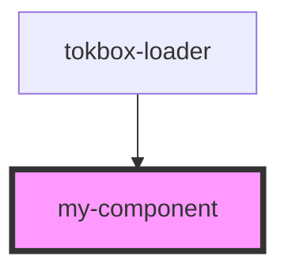

# my-component

<!-- Auto Generated Below -->

## Properties

| Property         | Attribute          | Description | Type     | Default |
| ---------------- | ------------------ | ----------- | -------- | ------- |
| `targetUserName` | `target-user-name` |             | `string` | `''`    |
| `userName`       | `user-name`        |             | `string` | `''`    |

## Dependencies

### Used by

 - [tokbox-loader](../loader-component)

### Graph

----------------------------------------------

*Built with [StencilJS](https://stenciljs.com/)*
